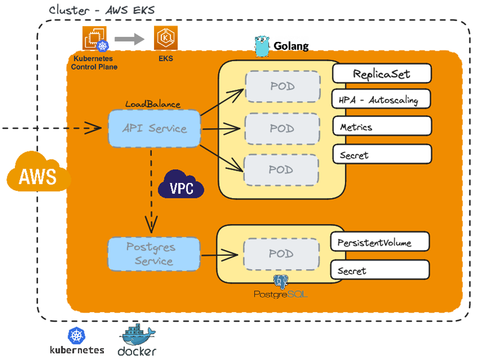
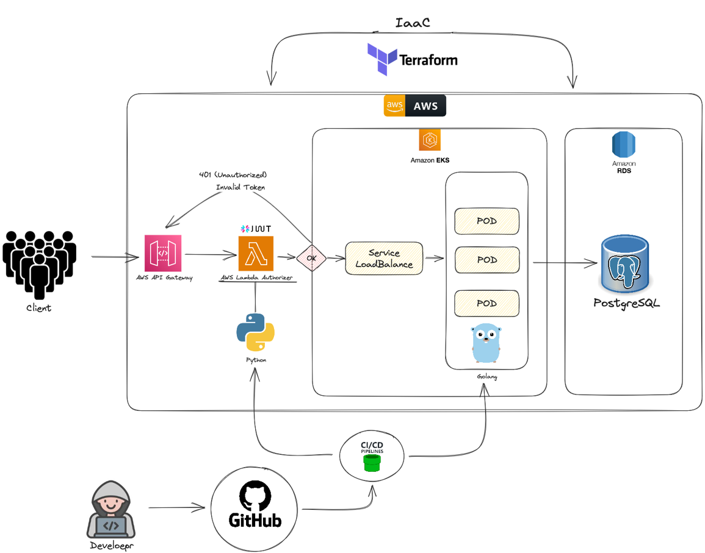

# Entregável Tech Challenge Fase 3

**Nome**: Fabiano Góes   
**RM**: 352678   
**Fase**: 3   

---
 
- [Entregável Tech Challenge Fase 3](#entregável-tech-challenge-fase-3)
  - [Lista de Entregáveis](#lista-de-entregáveis)
    - [1. Repositório da aplicação](#1-repositório-da-aplicação)
    - [2. Repositório da infraestrutura Kubernetes com Terraform](#2-repositório-da-infraestrutura-kubernetes-com-terraform)
    - [3. Repositório da infraestrutura banco de dados gerenciáveis com Terraform](#3-repositório-da-infraestrutura-banco-de-dados-gerenciáveis-com-terraform)
    - [4. Repositório da AWS Lambda do Authorizer](#4-repositório-da-aws-lambda-do-authorizer)
    - [5. Repositório do AWS API Gateway](#5-repositório-do-aws-api-gateway)
    - [6. Documetação da arquitetura EKS](#6-documetação-da-arquitetura-eks)
    - [7. Documetação da infraestrutura utilizada na nuvem escolhida](#7-documetação-da-infraestrutura-utilizada-na-nuvem-escolhida)
    - [8. Documentação da modelagem de dados](#8-documentação-da-modelagem-de-dados)
    - [9. Video com a explicação da infraestrutura utilizada na nuvem escolhida](#9-video-com-a-explicação-da-infraestrutura-utilizada-na-nuvem-escolhida)

## Lista de Entregáveis

### 1. Repositório da aplicação

:heavy_check_mark: https://github.com/fabianogoes/fiap-tech-challenge-restaurant-api

  
### 2. Repositório da infraestrutura Kubernetes com Terraform

:heavy_check_mark: https://github.com/fabianogoes/fiap-tech-challenge-cluster-eks-terraform

### 3. Repositório da infraestrutura banco de dados gerenciáveis com Terraform

:heavy_check_mark: https://github.com/fabianogoes/fiap-tech-challenge-rds-postgres-terraform

### 4. Repositório da AWS Lambda do Authorizer

:heavy_check_mark: https://github.com/fabianogoes/fiap-tech-challenge-authorizer-lambda

### 5. Repositório do AWS API Gateway

:heavy_check_mark: https://github.com/fabianogoes/fiap-tech-challenge-api-gateway-terraform

### 6. Documetação da arquitetura EKS

### 7. Documetação da infraestrutura utilizada na nuvem escolhida 

### 8. Documentação da modelagem de dados

### 9. Video com a explicação da infraestrutura utilizada na nuvem escolhida

:movie_camera: https://youtu.be/C8fR5DVMISA

